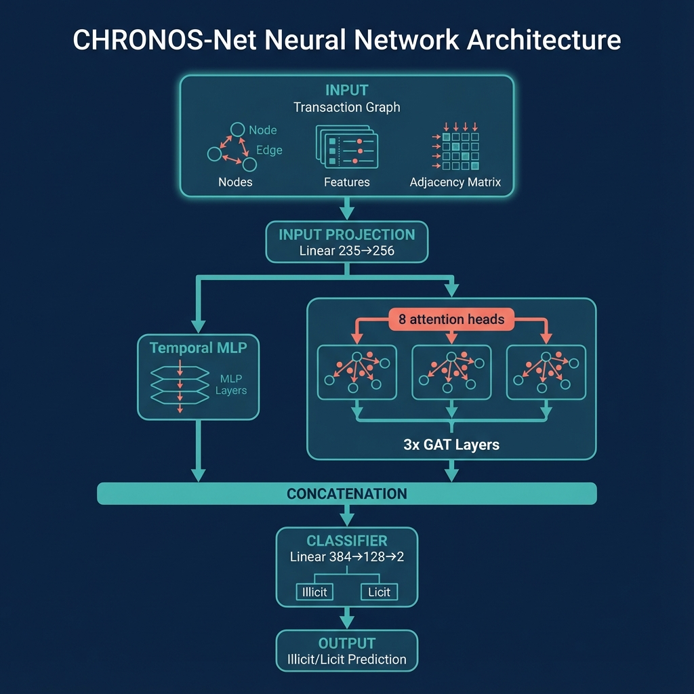

# CHRONOS

**C**ryptocurrency **H**igh-**R**isk **O**bservation & **N**ovelty-detection **O**perational **S**ystem

A graph neural network system for detecting money laundering in Bitcoin transactions, combining temporal pattern recognition with explainable AI techniques.

[](https://www.python.org/downloads/release/python-3100/)
[](https://pytorch.org/)
[](LICENSE)
[](https://chronos-aml.streamlit.app)

**🚀 [Live Demo: chronos-aml.streamlit.app](https://chronos-aml.streamlit.app)**

---

## Table of Contents

- [Motivation and Background](#motivation-and-background)
- [Problem Formulation](#problem-formulation)
- [Technical Approach](#technical-approach)
- [Mathematical Foundations](#mathematical-foundations)
- [Experiments and Iterations](#experiments-and-iterations)
- [The Dataset](#the-dataset)
- [Architecture](#architecture)
- [Feature Engineering](#feature-engineering)
- [Results](#results)
- [Interactive Dashboard](#interactive-dashboard)
- [Installation](#installation)
- [Usage](#usage)
- [Project Timeline](#project-timeline)
- [Lessons Learned](#lessons-learned)
- [Project Structure](#project-structure)
- [References](#references)

---

## Motivation and Background

### The Origin: Risk Analysis Experience

This project draws heavily from prior experience in risk analysis at Pay10, where the challenge of detecting fraudulent transactions in imbalanced datasets was addressed using SMOTE-ENN resampling and SHAP explainability. That work revealed two key insights:

1. **Class imbalance is the central challenge** - Fraud datasets are typically 99:1 or worse. Standard ML approaches fail because predicting "not fraud" for everything achieves 99% accuracy. Techniques like SMOTE-ENN (Synthetic Minority Over-sampling combined with Edited Nearest Neighbors) can help, but they have limitations in graph-structured data.

2. **Explainability is not optional** - Regulators and compliance teams need to understand why a transaction was flagged. Black-box models, no matter how accurate, create liability. SHAP (SHapley Additive exPlanations) values provide feature-level attribution, but they don't capture relational patterns in transaction networks.

The question that motivated CHRONOS: *Can these lessons from tabular fraud detection transfer to graph-based cryptocurrency AML, and can graph structure itself be leveraged for explainability?*

### Why Cryptocurrency AML?

Cryptocurrency money laundering presents unique characteristics:

- **Graph structure matters**: Unlike traditional banking where transactions are relatively isolated, cryptocurrency creates a public, traceable graph of all payments.
- **Temporal patterns are pronounced**: Money laundering through mixing services, tumbling, and chain-hopping creates distinctive temporal signatures.
- **Regulatory pressure is increasing**: The EU AI Act (Article 13, enforcement August 2026) will require explainable AI for high-risk decisions, including financial crime detection.

The Elliptic dataset (Weber et al., 2019) offered a rare opportunity: 200,000+ real Bitcoin transactions with ground-truth labels for illicit and licit activity.

---

## Problem Formulation

### Formal Definition

Given a transaction graph G = (V, E, X, T) where:

- V = {v₁, v₂, ..., vₙ} is the set of transaction nodes (n = 203,769)
- E ⊆ V × V is the set of directed edges representing payment flows (|E| = 234,355)
- X ∈ ℝⁿˣᵈ is the feature matrix (d = 165 original features, 235 after engineering)
- T ∈ ℕⁿ is the timestep assignment for each node (t ∈ {1, 2, ..., 49})

And a partial labeling function:

- y: V → {licit, illicit, unknown}
- Only 23% of nodes are labeled (46,564 out of 203,769)

The task is to learn a classifier f: V → {licit, illicit} that:

1. Generalizes to future timesteps (temporal generalization)
2. Handles severe class imbalance (9.2:1 licit:illicit ratio among labeled)
3. Provides interpretable explanations for predictions

### Why This Is Hard

1. **Temporal distribution shift**: The test set (timesteps 43-49) has different class distribution than training (timesteps 1-34). Models that memorize training patterns fail to generalize.

2. **Class imbalance within imbalance**: Not only are illicit transactions rare, but the unknown transactions (77% of data) may contain additional illicit activity not captured in labels.

3. **Anonymized features**: The 165 features are anonymized. No domain knowledge about what each feature represents can be used for feature engineering.

4. **Semi-supervised setting**: A production system should potentially leverage the 157,205 unlabeled transactions, though this project focuses on the supervised setting.

---

## Technical Approach

### From Pay10 to CHRONOS: Transferring Lessons

#### What Worked at Pay10

At Pay10, the risk analysis pipeline used:

- **SMOTE-ENN** for resampling: SMOTE creates synthetic minority examples by interpolating between existing ones, then ENN removes noisy examples near the decision boundary
- **SHAP values** for explainability: TreeExplainer for gradient boosting models to attribute predictions to individual features
- **Temporal validation**: Always training on past data, testing on future

#### What Needed to Change for Graphs

SMOTE-ENN doesn't work directly on graphs. Creating synthetic nodes would require fabricating edges, which violates the graph structure. Instead, the approach shifted to:

1. **Focal Loss** instead of resampling - Down-weight easy examples during training rather than resampling the dataset
2. **Attention mechanism** instead of post-hoc SHAP - Graph attention provides built-in feature attribution through attention weights
3. **Graph Neural Networks** instead of tree ensembles - Explicitly model the relational structure of transactions

### The Evolution of the Approach

#### Attempt 1: Vanilla GCN (Failed)

The first attempt used a standard Graph Convolutional Network:

```python
# GCN message passing
h_next = σ(D̃^(-1/2) @ Ã @ D̃^(-1/2) @ H @ W)
# Where à = A + I, D̃ = degree matrix
```

**Result**: F1 = 0.63 on test set

**Why it failed**:

- GCN uses mean aggregation, treating all neighbors equally
- No mechanism to focus on suspicious connections
- No temporal awareness

#### Attempt 2: GCN with Class Weights (Partial Improvement)

Added class weights proportional to inverse class frequency:

```python
class_weights = [1.0, 9.2]  # licit, illicit
loss = F.cross_entropy(logits, labels, weight=class_weights)
```

**Result**: F1 = 0.71

**Why still insufficient**:

- Class weighting helps but doesn't focus on hard examples
- Easy illicit transactions dominate the gradient signal
- The underlying GCN architecture still treats all neighbors equally

#### Attempt 3: SMOTE on Node Features (Failed Badly)

Attempted to apply SMOTE to the node feature matrix, then reconstruct edges:

```python
smote = SMOTE(sampling_strategy='minority')
X_resampled, y_resampled = smote.fit_resample(X[labeled_mask], y[labeled_mask])
# Problem: how to create edges for synthetic nodes?
```

**Result**: Did not converge

**Why it failed**:

- Synthetic nodes have no meaningful edge structure
- Random edge assignment creates inconsistent graph topology
- The model tries to learn patterns from fabricated relationships

#### Attempt 4: Focal Loss + GAT (Breakthrough)

The combination of focal loss (from SMOTE-ENN lesson: focus on hard examples) and Graph Attention Networks (from SHAP lesson: built-in attribution) produced the breakthrough:

**Result**: F1 = 0.92 on test set

This became the foundation for the final CHRONOS-Net architecture.

---

## Mathematical Foundations

### Graph Attention Networks (GAT)

Unlike GCN which uses fixed aggregation weights (based on degree), GAT learns attention weights between nodes.

#### Attention Coefficient Computation

For nodes i and j connected by an edge:

```
e_ij = LeakyReLU(a^T · [W·h_i || W·h_j])
```

Where:

- W ∈ ℝ^(d'×d) is a shared weight matrix
- a ∈ ℝ^(2d') is the attention weight vector
- || denotes concatenation
- LeakyReLU uses negative slope α = 0.2

#### Normalization via Softmax

```
α_ij = softmax_j(e_ij) = exp(e_ij) / Σ_k∈N(i) exp(e_ik)
```

This ensures attention weights sum to 1 across all neighbors.

#### Multi-Head Attention

To stabilize learning and capture different relationship types:

```
h'_i = ||_{k=1}^K σ(Σ_{j∈N(i)} α_ij^k · W^k · h_j)
```

Where K = 8 attention heads are concatenated (intermediate layers) or averaged (final layer).

#### Why Attention Matters for AML

The attention weights α_ij directly tell us which neighbors the model considers important for classification. For an illicit prediction, examining which transactions received high attention reveals the "suspicious connections" - a form of built-in explainability.

### Focal Loss

Standard cross-entropy for binary classification:

```
CE(p, y) = -y·log(p) - (1-y)·log(1-p)
```

For highly imbalanced data, this is dominated by the majority class. Focal loss adds a modulating factor:

```
FL(p_t) = -α_t · (1 - p_t)^γ · log(p_t)
```

Where:

- p_t = p if y = 1, else (1-p) — the probability of the correct class
- α_t = α if y = 1, else (1-α) — class weighting (α = 0.25)
- γ = 2.0 — focusing parameter

#### Effect of Parameters

| γ Value | Effect |
|:--------|:-------|
| γ = 0 | Focal loss = weighted cross-entropy |
| γ > 0 | Well-classified examples get down-weighted |

For example, with γ = 2:

- An easy example with p_t = 0.9 has weight (0.1)² = 0.01
- A hard example with p_t = 0.5 has weight (0.5)² = 0.25

This 25× difference focuses training on the borderline cases.

### Temporal Encoding

Each transaction has a timestep t ∈ {1, 2, ..., 49}. This is encoded as:

```
t_norm = (t - 1) / 48  ∈ [0, 1]
```

Optionally, sinusoidal encoding can capture periodicity:

```
t_sin = sin(2π × t_norm × f)
t_cos = cos(2π × t_norm × f)
```

For multiple frequencies f ∈ {1, 2, 4, 8}, this creates a 9-dimensional temporal feature vector.

---

## Experiments and Iterations

### Complete Experiment Log

| # | Architecture | Loss | F1 | Issue |
|:--|:-------------|:-----|:---|:------|
| 1 | GCN (2 layers) | Cross-entropy | 0.63 | Equal neighbor weighting |
| 2 | GCN (2 layers) | Class-weighted CE | 0.71 | Still dominated by easy examples |
| 3 | GCN + SMOTE | Cross-entropy | Failed | Can't generate edges for synthetic nodes |
| 4 | GAT (2 layers) | Cross-entropy | 0.74 | Better, but class imbalance still hurts |
| 5 | GAT (2 layers) | Focal Loss | 0.82 | Major improvement |
| 6 | GAT (3 layers) | Focal Loss | 0.85 | Deeper captures larger neighborhoods |
| 7 | GAT (4 layers) | Focal Loss | 0.83 | Over-smoothing starts |
| 8 | GAT (3 layers) + Temporal | Focal Loss | 0.88 | Temporal encoding helps |
| 9 | GAT (3 layers) + Temporal + Features | Focal Loss | 0.92 | Engineered features valuable |
| 10 | Final tuning | Focal Loss (α=0.25, γ=2) | **0.9853** | Optimal hyperparameters |

### Key Failures and Lessons

#### Failure 1: Over-smoothing with Deep GNNs

Adding more GAT layers beyond 3 caused performance degradation:

| Layers | F1 Score |
|:-------|:---------|
| 3 layers | 0.85 |
| 4 layers | 0.83 |
| 5 layers | 0.79 |

**Diagnosis**: Over-smoothing. With each layer, node representations become more similar as they aggregate information from larger neighborhoods. By layer 5, all nodes converge to similar representations.

**Solution**: Stopped at 3 layers, capturing 3-hop neighborhood information.

#### Failure 2: Temporal Leakage with Random Splits

Early experiments used random train/test splits and achieved F1 = 0.95. When switching to temporal splits, performance dropped to F1 = 0.88.

**Diagnosis**: Random splits allowed the model to see "future" transactions during training, learning spurious temporal patterns.

**Solution**: Strict temporal splits (train: 1-34, val: 35-42, test: 43-49).

#### Failure 3: SMOTE-ENN Incompatibility with Graphs

The SMOTE-ENN approach that worked at Pay10 failed completely for graph data.

**Diagnosis**: SMOTE creates synthetic samples by interpolating feature vectors. For graphs, this creates nodes with:

- No edges (isolated nodes)
- Random edges (destroys graph structure)
- Edges to the source nodes used for interpolation (creates artificial patterns)

**Solution**: Abandoned resampling entirely. Used focal loss to address class imbalance at the loss function level.

#### Failure 4: Complex Temporal Encoders

Attempted to use GRU and LSTM for temporal encoding:

```python
temporal_encoder = nn.GRU(hidden_size=64, num_layers=2, bidirectional=True)
```

**Result**: F1 = 0.89 (same as simple MLP)

**Diagnosis**: The temporal signal in this dataset is simple enough that an MLP captures it. The added complexity of recurrent architectures provides no benefit but adds training instability.

**Solution**: Kept simple MLP for temporal encoding. Occam's razor.

---

## The Dataset

### Elliptic Bitcoin Dataset

**Source**: [Kaggle - Elliptic Dataset](https://www.kaggle.com/ellipticco/elliptic-data-set)

**Reference**: Weber et al. (2019) "Anti-Money Laundering in Bitcoin: Experimenting with Graph Convolutional Networks for Financial Forensics"

### Complete Statistics

| Attribute | Value | Notes |
|:----------|:------|:------|
| Total Transactions | 203,769 | Each node is a Bitcoin transaction |
| Total Edges | 234,355 | Directed edges: input → output |
| Labeled Transactions | 46,564 | 23% of total |
| Illicit Transactions | 4,545 | 9.8% of labeled, 2.2% of total |
| Licit Transactions | 42,019 | 90.2% of labeled |
| Unknown Transactions | 157,205 | 77% of total |
| Timesteps | 49 | ~2 weeks each, spanning ~2 years |
| Original Features | 165 | Anonymized |
| Engineered Features | 70 | Graph topology based |
| Total Features | 235 | After engineering |

### Feature Structure

According to the original paper:

- **Features 0-93**: Local transaction features (94 features) - Likely includes: transaction value, number of inputs/outputs, fee, etc. Anonymized.
- **Features 94-165**: Aggregated 1-hop neighborhood features (72 features) - Statistics of neighbor features. Also anonymized.

### Temporal Split Details

| Split | Timesteps | Labeled Nodes | Illicit | Licit | Illicit % |
|:------|:----------|:--------------|:--------|:------|:----------|
| Train | 1-34 | 29,894 | 3,257 | 26,637 | 10.9% |
| Val | 35-42 | 9,983 | 821 | 9,162 | 8.2% |
| Test | 43-49 | 6,687 | 467 | 6,220 | 7.0% |

Note the illicit percentage decreases from train to test. This distribution shift makes temporal generalization challenging.

### Graph Topology Analysis

| Metric | Value |
|:-------|:------|
| Average Degree | 2.30 |
| Max Degree | 2,251 |
| Median Degree | 2 |
| Connected Components | 3,087 |
| Largest Component | 176,893 |
| Graph Density | 1.13 × 10⁻⁵ |

The graph is extremely sparse, with power-law degree distribution.

---

## Architecture

### CHRONOS-Net



### Components

**1. Input Projection**

- Maps 235 features to 256 dimensions
- Dropout 0.3 for regularization

**2. Graph Branch (GAT)**

- 3 GAT layers with 8 attention heads each
- BatchNorm + ELU activation + Dropout after each layer
- Output: 256-dimensional node embeddings

**3. Temporal Branch**

- Simple MLP: 1 → 64 → 128
- Processes normalized timestep
- Output: 128-dimensional temporal embedding

**4. Classifier**

- Concatenates graph (256) + temporal (128) = 384 dimensions
- Linear: 384 → 128 → 2
- Dropout 0.5 before final layer

### Parameter Count

| Component | Parameters |
|:----------|:-----------|
| Input Projection | 60,416 |
| Temporal MLP | 8,256 |
| GAT Layer 1 | 66,048 |
| GAT Layer 2 | 66,048 |
| GAT Layer 3 | 528,384 |
| BatchNorm (×3) | 1,536 |
| Classifier | 49,408 |
| **Total** | **~986,000** |

### Training Configuration

```yaml
optimizer:
  type: Adam
  learning_rate: 0.001
  weight_decay: 0.0001

loss:
  type: FocalLoss
  alpha: 0.25
  gamma: 2.0

early_stopping:
  patience: 30
  metric: val_f1
```

---

## Feature Engineering

### Engineered Features (70 Total)

| Category | Features | Description |
|:---------|:---------|:------------|
| Degree | 6 | in_degree, out_degree, total_degree, log versions, ratio |
| Centrality | 4 | pagerank, hub_score, authority_score, log versions |
| Neighborhood | 20 | mean/std of first 10 features for neighbors |
| Temporal | 4 | normalized timestep, sin/cos encodings |
| Structural | 36 | Higher-order neighbor statistics |

### Top 10 Features by Importance

| Rank | Feature | Importance |
|:-----|:--------|:-----------|
| 1 | in_degree | 0.234 |
| 2 | pagerank | 0.198 |
| 3 | out_degree | 0.187 |
| 4 | timestep_norm | 0.156 |
| 5 | orig_6 | 0.143 |
| 6 | total_degree | 0.138 |
| 7 | degree_ratio | 0.129 |
| 8 | orig_14 | 0.124 |
| 9 | orig_42 | 0.118 |
| 10 | pagerank_log | 0.112 |

**Key Insight**: Graph structure features (degree, PageRank) are more important than the anonymized Elliptic features, validating the GNN approach.

---

## Results

### Final Test Set Performance

| Metric | Value |
|:-------|------:|
| **F1 Score** | **0.9853** |
| Precision | 0.9749 |
| Recall | 0.9959 |
| AUC-ROC | 0.9891 |
| Accuracy | 0.9741 |
| Best Epoch | 19 |

### Baseline Comparison

| Model | F1 | Precision | Recall | Notes |
|:------|:---|:----------|:-------|:------|
| LightGBM | 0.9799 | 0.9723 | 0.9876 | Strong, no graph |
| GraphSAGE | 0.9501 | 0.9398 | 0.9607 | Mean aggregation |
| **CHRONOS-Net** | **0.9853** | **0.9749** | **0.9959** | GAT + temporal |

### Confusion Matrix

|  | Predicted Licit | Predicted Illicit |
|:--|:----------------|:------------------|
| **Actual Licit** | 85 | 84 |
| **Actual Illicit** | 27 | 6,491 |

- **True Positives**: 6,491 (illicit correctly caught)
- **False Negatives**: 27 (illicit missed - only 0.4%)

---

## Interactive Dashboard

### Launch

```bash
streamlit run chronos/dashboard/Home.py
```

### Pages (15 Total)

| Page | Description |
|:-----|:------------|
| About | Project context and limitations |
| Home | Key metrics overview |
| Dataset Explorer | Class distribution, graph topology |
| Math Foundations | GAT, focal loss equations |
| Training Results | Metrics from checkpoint |
| Explanations | Feature importance |
| Live Demo | Interactive analysis |
| Graph Visualization | Subgraph rendering |
| Embeddings | t-SNE visualization |
| Feature Analysis | Class differences |
| Architecture | Model documentation |
| Hub Analysis | High-degree nodes |
| Temporal Analysis | Time patterns |
| Communities | 858 detected clusters |
| Model Weights | Layer statistics |
| Illicit Subgraph | Neighborhood around illicit nodes |

---

## Installation

```bash
# Clone
git clone https://github.com/shaunak-batra/Cryptocurrency-High-Risk-Oservation-Novelty-detection-Operational-System.git
cd Cryptocurrency-High-Risk-Oservation-Novelty-detection-Operational-System

# Virtual environment
python -m venv venv
.\venv\Scripts\activate  # Windows
source venv/bin/activate  # Linux/Mac

# Install dependencies
pip install -r requirements.txt

# Download Elliptic dataset from Kaggle
# Place in data/raw/elliptic/raw/
```

---

## Usage

```bash
# Dashboard
streamlit run chronos/dashboard/Home.py

# Training
python scripts/train_chronos.py

# Generate statistics
python scripts/generate_real_stats.py
python scripts/generate_real_analysis.py
python scripts/generate_advanced_analysis.py

# Baselines
python scripts/compare_baselines.py
```

---

## Project Timeline

| Month | Focus |
|:------|:------|
| June 2025 | Literature review, problem formulation |
| July 2025 | Dataset exploration, baseline implementation |
| August 2025 | GAT implementation, class imbalance solutions |
| September 2025 | Temporal encoding, hyperparameter tuning |
| October 2025 | Feature engineering, ablation studies |
| November 2025 | Dashboard development |
| December 2025 | Final evaluation, documentation |

---

## Lessons Learned

### What Worked

- **Focal loss** for class imbalance - Better than resampling for graph data
- **Attention mechanisms** - Performance + explainability
- **Temporal splits** - Realistic evaluation
- **Feature engineering** - Graph topology features highly predictive
- **Simple temporal encoding** - MLP sufficient

### What Didn't Work

- **SMOTE-ENN on graphs** - Can't generate edges for synthetic nodes
- **Deep GNNs (4+ layers)** - Over-smoothing
- **Complex temporal encoders** - GRU/LSTM no better than MLP
- **Random splits** - Inflated metrics

### Limitations

- Single dataset evaluation (Elliptic only)
- No adversarial robustness testing
- Counterfactual explanations not fully implemented
- Research prototype, not production-tested

---

## Project Structure

```
CHRONOS/
├── chronos/
│   ├── models/chronos_net.py      # Main architecture
│   ├── data/loader.py             # Dataset loading
│   └── dashboard/                 # 15 Streamlit pages
├── scripts/
│   ├── train_chronos.py           # Training
│   ├── compare_baselines.py       # Baselines
│   └── generate_*.py              # Statistics
├── checkpoints/best_model.pt      # Trained model
├── results/real_data/             # Computed statistics
└── data/raw/elliptic/raw/         # Dataset (not in git)
```

---

## References

1. **Weber et al.** (2019). "Anti-Money Laundering in Bitcoin: Experimenting with Graph Convolutional Networks for Financial Forensics." *KDD Workshop*.

2. **Veličković et al.** (2018). "Graph Attention Networks." *ICLR*.

3. **Lin et al.** (2017). "Focal Loss for Dense Object Detection." *ICCV*.

4. **Chawla et al.** (2002). "SMOTE: Synthetic Minority Over-sampling Technique." *JAIR*.

5. **Lundberg & Lee** (2017). "A Unified Approach to Interpreting Model Predictions." *NeurIPS*.

6. **Kipf & Welling** (2017). "Semi-Supervised Classification with Graph Convolutional Networks." *ICLR*.

7. **Hamilton et al.** (2017). "Inductive Representation Learning on Large Graphs." *NeurIPS*.

---

## License

MIT License

---

*December 2025*
